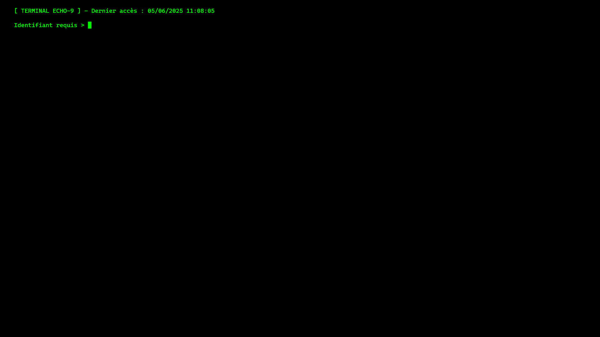
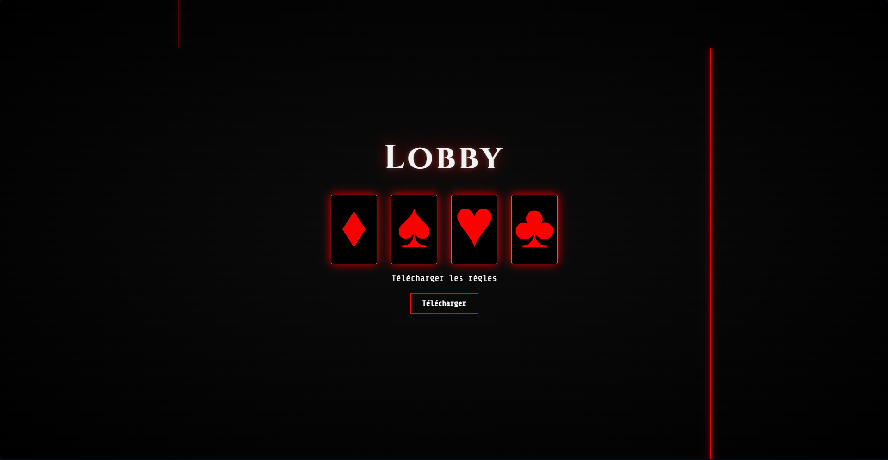
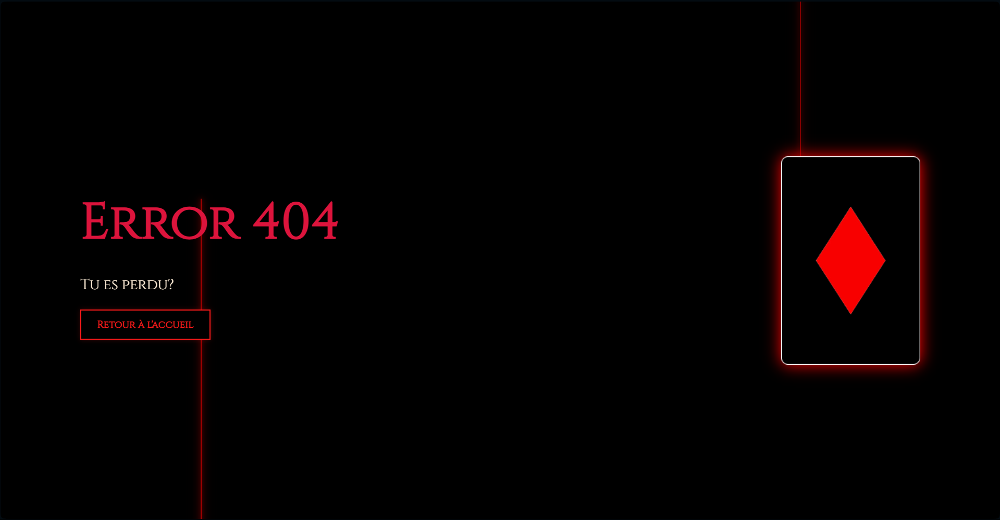

# 👋 Hi There.
 
Je m'appelle **Omega**, passionné d'informatique, de création numérique et d'expérimentations en tous genres.  
Je transforme mes idées en expériences immersives, mystérieuses, parfois tricky, mais toujours stylées.

---

## 🧠 À propos de moi

Je suis un étudiant suisse en informatique avec un esprit de créatif libre.  
Ce que j'aime ? Créer des univers, jouer avec les règles, détourner la logique, et construire des choses qui sortent du cadre.

Mes influences vont du **game dev** au **Web dev**, en passant par le **design** et la culture **ciné/technologie**.  
Je code, je conçois, je modifie, j'explore. C'est mon terrain de jeu.

---

## 🛠️ Compétences

- HTML / CSS / JavaScript  
- Python, Java (notions)  
- Unity (C#), modding Minecraft  
- Git & GitHub  
- Web design (UI, animations, Figma)  
- Game design et conception de projets  

---

## 🚀 Projet terminé : 
**ECHO-9**

**Une chasse au trésor numérique.**  
Des indices camouflés dans des fichiers.  
Des mécaniques multiples.  
Des easter eggs, des références, des secrets.  
Une seul but : explorer. Observer. Comprendre.

  
  

> 🎯 But final : atteindre le terminal et découvrir ce qui se cache derrière l’écran.  
> Si tu trouves le trophée... tu l’as mérité.
> Bonne chance!
> Si tu veux commencer, ça se passe là 👉 [Omegaa.ch](omegaa.ch)

---

## 🎯 Objectifs

- Pousser mes idées jusqu’au bout, même les plus folles  
- Travailler sur des projets immersifs, magiques et techniques à la fois  
- Développer un max de mes projets
- Et surtout pouvoir vivre (très très bien) de mes différentes passions!

---

## 📫 Contact

Tu peux me contacter via Whatsapp ou en email si tu veux discuter projet, dev ou idées 🔥
- WhatsApp : +41 77 504 23 00
- Email "Pro" (qui a 7 ans): Plasma.omega12@gmail.com
- Email étudiant: Eliot.bd@eduge.ch

---

End.
